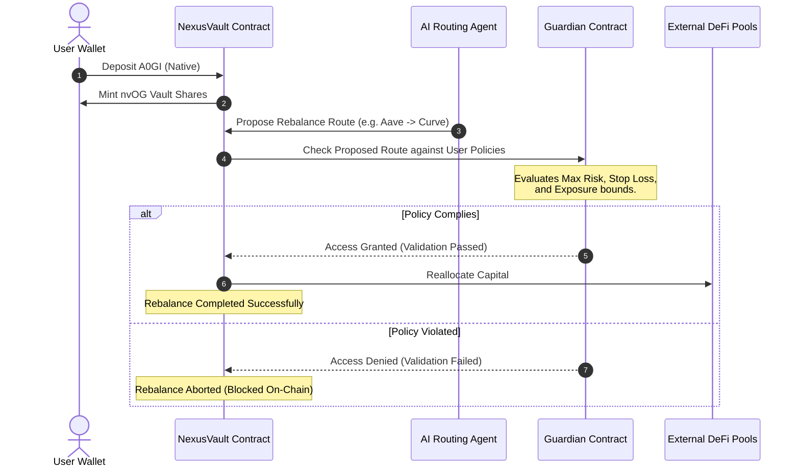

# NexusVault

An AI-agent routed native yield aggregator built on the **0G Galileo Testnet**. NexusVault allows users to deposit native 0G tokens (`A0GI`) to earn optimized yield managed by an autonomous AI agent, protected by a cryptographic **Guardian** smart contract that enforces user-defined safety policies on-chain.

---

## 1. Product Overview

NexusVault bridges AI-driven asset management with on-chain cryptographic safety nets. 

### Core Features
* **Native 0G Integration**: Deposit native `A0GI` tokens directly into the vault. Under the hood, native tokens are wrapped into Wrapped OG (`WOG`) and allocated across decentralized finance yield protocols.
* **AI-Agent Optimization**: Active yield strategies are calculated and executed by autonomous AI agents registered on-chain via the `AgentRegistry`.
* **Cryptographic Guardrails**: The `Guardian` smart contract acts as a gateway, ensuring the AI agent can never execute transactions that violate user-defined parameters.
* **0G Data Availability (DA)**: Rebalancing traces, decisions, and model performance metrics are published to the 0G DA layer for absolute transparency.

---

## 2. System Architecture & Workflow

### User Interaction & Transaction Flow

```
   ┌──────────┐              ┌──────────────┐              ┌──────────────┐
   │   User   ├─────────────►│  NexusVault  ├─────────────►│  Wrapped OG  │
   │  Wallet  │ Deposits     │   Contract   │ Wraps A0GI   │    (WOG)     │
   └────┬─────┘ A0GI         └──────┬───────┘ to WOG       └──────┬───────┘
        │                           │                             │
        │ Sets                      │ Queries                     │ Allocates
        │ Guardrails                │ Rules                       │ Capital
        ▼                           ▼                             ▼
   ┌──────────┐              ┌──────────────┐              ┌──────────────┐
   │ Guardian │◄─────────────┤   AI Agent   ├─────────────►│ DeFi Pools   │
   │ Contract │ Enforces     │ (Registered) │ Rebalances   │ (Aave/Curve) │
   └──────────┘ Policies     └──────────────┘ Yield        └──────────────┘
```

### Protocol Rebalance Process (Mermaid Diagram)



---

## 3. Deployed Smart Contracts

The protocol is fully deployed on the **0G Galileo Testnet** (Chain ID: `16602`). You can view the code, transactions, and on-chain status of the contracts directly on the explorer.

### Galileo Testnet Contract Addresses

| Smart Contract | Address | On-Chain Link |
| :--- | :--- | :--- |
| **NexusVault** | `0x31E0938512Fc66844d04CB1f489b584C349e53dD` | [View on Chainscan](https://chainscan-galileo.0g.ai/address/0x31E0938512Fc66844d04CB1f489b584C349e53dD) |
| **Guardian** | `0x1ee4db294Ec9f732f9197fB1a1B36Bf04fbe6Eb1` | [View on Chainscan](https://chainscan-galileo.0g.ai/address/0x1ee4db294Ec9f732f9197fB1a1B36Bf04fbe6Eb1) |
| **Wrapped OG (WOG)** | `0x804A6881d64593E0d6d72551E21e23777bbc807C` | [View on Chainscan](https://chainscan-galileo.0g.ai/address/0x804A6881d64593E0d6d72551E21e23777bbc807C) |
| **AgentRegistry** | `0x4391e6D983caF7142cEB9C4748C5CDf7d8f18b6d` | [View on Chainscan](https://chainscan-galileo.0g.ai/address/0x4391e6D983caF7142cEB9C4748C5CDf7d8f18b6d) |

### Local Hardhat Node Addresses (Default Development Network)

| Smart Contract | Address | Purpose |
| :--- | :--- | :--- |
| **NexusVault** | `0xDc64a140Aa3E981100a9becA4E685f962f0cF6C9` | Local native yield vault |
| **Guardian** | `0x5FbDB2315678afecb367f032d93F642f64180aa3` | Local cryptographic policy evaluator |
| **WOG** | `0x9fE46736679d2D9a65F0992F2272dE9f3c7fa6e0` | Local wrapped 0G native token wrapper |
| **AgentRegistry** | `0xe7f1725E7734CE288F8367e1Bb143E90bb3F0512` | Local agent directory registry |

---

## 4. Technical Stack

```
   ┌────────────────────────────────────────────────────────┐
   │                        FRONTEND                        │
   │      Next.js (App Router) · React · Tailwind CSS       │
   │         Privy Wallet Auth · Wagmi / Viem v2           │
   └───────────────────────────┬────────────────────────────┘
                               │ JSON-RPC
                               ▼
   ┌────────────────────────────────────────────────────────┐
   │                      SMART CONTRACTS                    │
   │               Solidity v0.8.24 · Hardhat               │
   └───────────────────────────┬────────────────────────────┘
                               │ EVM Execution
                               ▼
   ┌────────────────────────────────────────────────────────┐
   │                     INFRASTRUCTURE                     │
   │       0G Galileo EVM Testnet · 0G Data Availability    │
   └────────────────────────────────────────────────────────┘
```

---

## 5. Development & Deployment Guide

### Prerequisites
* Node.js v18.0.0 or higher
* npm or pnpm

### 1. Smart Contract Development & Deployment
```bash
# Navigate to the contracts project
cd contracts

# Install Hardhat dependencies
npm install

# Compile contracts
npx hardhat compile

# Run local Hardhat node
npx hardhat node

# Deploy to local node
npm run deploy:local

# Deploy to 0G Galileo Testnet
# Make sure to configure PRIVATE_KEY in contracts/.env first
npx hardhat run scripts/deploy.js --network 0g-testnet
```

### 2. Frontend Development & Deployment
```bash
# Navigate to the frontend project
cd ../frontend

# Install dependencies (utilizes .npmrc to handle peer resolutions)
npm install

# Start local Next.js Webpack development server
npm run dev

# Build for production (fully verified compilation)
npm run build
```

---

## 6. Development Culture

We maintain a clean, security-first codebase designed for modularity and auditability:
* **Securing Private Keys**: Environment files (`.env`) are strictly untracked and barred from source control using a root-level `.gitignore`.
* **Zero Magic Strings**: Contract ABIs, chain definitions, and wallet IDs are centrally configured to prevent runtime mismatches.
* **Predictable Upgrades**: Contracts follow modular patterns separating logic (Agents), state (Vault), and validation (Guardians).
